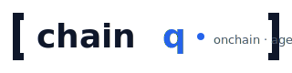

<div align="center">



**Open-source onchain analytics, MCP-native.**

chainq is the self-hosted, AI-agent-driven analogue of Dune Analytics:
same architecture (Parquet on disk · dbt curated tables · SQL engine),
same Spellbook lineage (MIT-licensed cross-compatible models), plus a
first-class MCP server with 20 tools so agents — not just humans
clicking buttons — drive the analysis. Pre-alpha; see [Status](#status).

> Not affiliated with Dune Analytics, Inc. References to "Dune" here are
> for architectural comparison only.

[](https://github.com/Jacksstt/chainq/actions/workflows/ci.yml)
[](#status)
[](LICENSE)
[](#requirements)
[](https://modelcontextprotocol.io/)
[](https://duckdb.org/)
[](https://github.com/duckdb/dbt-duckdb)

**No infrastructure? No problem.** Try without installing anything:

[](https://codespaces.new/Jacksstt/chainq)
[](https://render.com/deploy?repo=https://github.com/Jacksstt/chainq)
&nbsp; · &nbsp; [Browser playground (DuckDB-WASM)](https://jacksstt.github.io/chainq/)

</div>

---

## What

**chainq = Dune's architecture, open-sourced, with MCP bolted on.**

Dune uses Parquet + dbt + a SQL engine + curated tables called Spellbook
to serve onchain analytics to humans through a web UI. chainq uses the
**same shape**:

- **Storage**: Apache Parquet on local disk or S3 (Dune: Iceberg-on-Parquet on their S3)
- **Transformation**: dbt-duckdb + chainq Spellbook fork (Dune: dbt-trino + their Spellbook, both MIT — models cross-portable)
- **Engine**: DuckDB single-process (Dune: distributed Trino — same SQL family, ~95% dialect overlap)
- **Curated table names**: `dex.trades`, `erc20.transfers`, `nft.trades`, `prices.usd`, `labels.addresses`, `filecoin.deals`, `solana.dex.trades`, etc. — schema-compatible with Dune

What chainq adds:

1. **Self-host**: clone, install, run. No credits, no per-query billing, no data leaving your VPC.
2. **MCP server**: 20 tools so AI agents — Claude Code, Codex, OpenClaw, Cursor, Cline — drive the analysis. Cost estimation before execution, per-session budget caps that *refuse* to run breaching queries, BM25 recall of past work, structured `ChainqError { code, details }` so agents branch programmatically.
3. **Writing rubric**: an 8-criterion scorer + structured writing primitives (`executiveBullet`, `anomalyCallout`, `comparison`, `actionItem`) so AI-generated reports can't ship with mechanical filler.
4. **Bilingual JA/EN reports with brand customisation** — single-file HTML, dark/light auto, embedded charts (SVG / interactive HTML / PNG / vega-lite JSON), CSV downloads, sparkline-in-table cells.

A team that's hitting Dune's quota wall, can't move data into Dune for
compliance reasons, or wants to drive analysis from AI agents instead of
a web UI — that team can move to chainq and **keep most of their dbt
models intact** (just swap the adapter).

For the full feature-by-feature cut: [docs/COMPARISON.md](docs/COMPARISON.md).
For the engineering layer-by-layer cut: [docs/COMPARISON-ARCHITECTURE.md](docs/COMPARISON-ARCHITECTURE.md).

## Why

Dune (2019) and Nansen (2020) were built when **humans wrote SQL**. In 2026, the primary consumer of onchain data is increasingly an **AI agent**:

- An agent needs **machine-readable schemas**, not a web autocomplete.
- An agent needs **cost estimates upfront**, not a "you ran out of credits" message after the fact.
- An agent needs **structured errors**, not HTML stack traces.
- An agent needs **persistent memory** of what it has already queried.
- A team that owns sensitive data needs **self-hosting**, not a vendor API.

Nansen shipped an excellent agent-facing CLI in 2026. We respect it. But it's closed-source, label-driven, and doesn't let you run arbitrary SQL over your own indexed data. Dune is open in spirit (Spellbook is OSS) but the engine and agent surface are proprietary.

`chainq` fills the gap: **fully OSS, self-hosted, MCP-first, SQL-open**.

## Who it's for

- **Researchers and consultancies** who need to investigate onchain projects rapidly and store evidence locally.
- **Builders** who want their dApp's data warehouse with no vendor lock-in.
- **Agentic-finance teams** who need an LLM agent to do due diligence without exfiltrating sensitive data to a third party.
- **Hobbyists** who want a Dune-grade environment on a laptop.

## Status

**Pre-alpha.** Active development; APIs will break without notice until `0.1.0`.

What's **proven working** (in CI / smoke tests / dbt run / live mainnet):

- **45 chains supported end-to-end**: 43 EVM via public Subsquid archives + Solana (Helius) + Filecoin (Filfox / Spacescan). Reachability is probed on every push; the live list is at [docs/SUPPORTED-CHAINS.md](docs/SUPPORTED-CHAINS.md)
- **18 MCP tools** across 8 capability groups (discovery / execution / semantic / analytics / recall / render / report / budget)
- **11 curated catalog tables**: `base.logs`, `dex.trades`, `erc20.transfers`, `prices.usd`, `labels.addresses`, `filecoin.deals`, `solana.transfers`, `solana.dex.trades`, `nft.trades`, `lending.events`, `bridge.transfers`
- **21 semantic-layer metrics**, including cross-table joins (DEX × prices, ERC-20 × labels, sanctioned exposure) and a live-data metric (`base_logs_hourly`)
- **dbt-duckdb spellbook: 23 working models, 42 dbt tests** — schema constraints (`not_null`, `accepted_values`) enforced at build time, plus a topic0 decoder (raw logs → ERC-20 Transfer events) that closes the loop on live data
- **Live Base mainnet ingest**: `chainq pull --chain base --from 24000000 --to 24000010` against the public Subsquid archive returned **6,534 logs across 11 blocks** with the expected 2-second cadence and `WETH (0x4200…0006)` + `USDC (0x833589fc…02913)` as the top emitters — full evidence at [docs/LIVE-INGEST-PROOF.md](docs/LIVE-INGEST-PROOF.md)
- **Bilingual single-file HTML reports** (JA / EN / both with CSS toggle, no JS), brand customisation, interactive vega-embed charts, CSV download chips
- **Per-session cost governor** (`chainq_budget_set/status/clear`) with structured `BUDGET_EXCEEDED` errors and BM25-ranked `chainq_recall`
- **Benchmark suite** ([BENCHMARKS.md](docs/BENCHMARKS.md)) — P95 0.5 ms - 27 ms across 10 representative queries on a 103.6 MiB dataset

What's **still pending**:

- **dbt against real data**: the 18 spellbook models read seeded synthetic Parquet by default. Pointing them at the live-pulled `base.logs.parquet` is the next milestone (the engine and metric YAMLs already accept it; only the spellbook source mapping needs the swap).
- **Operational reliability**: no 90-day uptime trace yet; reorg-safe head-following is unimplemented (the live archive serves finalised blocks, so the current path is bounded but not stress-tested).
- **Real Whuffie / Agentic Finance dogfooding**: pending Phase 2 of [docs/ROADMAP.md](docs/ROADMAP.md).

See [docs/ROADMAP.md](docs/ROADMAP.md) for the full list of distance markers.

## Quickstart

Pick one — they all reach the same place.

| You want | Do this |
|---|---|
| **No install, just try** | [Browser playground](https://jacksstt.github.io/chainq) — paste a Parquet URL, write SQL |
| **One-click cloud VM** | [Open in Codespaces](https://codespaces.new/Jacksstt/chainq) — chainq running with seed data in a hosted VS Code |
| **One-click deploy** | [Deploy to Render](https://render.com/deploy?repo=https://github.com/Jacksstt/chainq) — public URL, free tier |
| **One-line laptop install** | `curl -fsSL https://raw.githubusercontent.com/Jacksstt/chainq/main/scripts/install.sh \| sh` |
| **Docker on laptop** | `docker compose -f docker/docker-compose.yml up` |
| **Dev from source** | See below |

All paths are documented in [`docs/INSTALL.md`](docs/INSTALL.md).

### Dev from source

```bash
git clone https://github.com/Jacksstt/chainq.git
cd chainq
pnpm install
pnpm seed              # generate sample Parquet files in ./data
pnpm test              # typecheck + smoke + MCP end-to-end test
pnpm mcp:serve         # start the MCP server over stdio
```

Wire it into Claude Code (one-time):

```bash
claude mcp add chainq -- pnpm --dir /absolute/path/to/chainq mcp:serve
```

Three integration paths are documented in [`docs/CLAUDE_CODE_INTEGRATION.md`](docs/CLAUDE_CODE_INTEGRATION.md).

Then in Claude Code:

> _"Use chainq. Tell me how many DEX trades happened on Base, and show me a query against `dex.trades` aggregated by hour."_

The agent will call `chainq_list_tables`, `chainq_describe`, `chainq_estimate_cost`,
and `chainq_query` in sequence and stream results back.

### The RPC-free path

If you don't want to pay for an Alchemy / Infura subscription, pull a Parquet
snapshot from a public Subsquid archive instead:

```bash
chainq pull --chain base --from 18000000 --to 18001000
# → writes data/base.logs.parquet
```

No node, no RPC key, no monthly bill. See
[`packages/snapshot`](packages/snapshot) and
[`docker/`](docker) for the full self-hosted stack.

### What's working today (v0.0.x)

**18 MCP tools** across 8 capability groups (discovery / execution /
semantic / analytics / recall / render / report / budget). Run
`chainq tools` for the auto-generated list, or `chainq mcp serve` and
send `tools/list` from any MCP client.

| Group | Tool | Notes |
|---|---|---|
| Discovery | `chainq_list_tables` | Enumerate the catalog |
| Discovery | `chainq_search_tables` | Free-text + chain filter |
| Discovery | `chainq_describe` | Schema, sample rows, lineage, sample queries, partitions, gotchas |
| Execution | `chainq_estimate_cost` | Row / cost estimate + budget decision (advisory) |
| Execution | `chainq_query` | DuckDB SQL with row + timeout caps; budget-aware; cached |
| Semantic | `chainq_list_metrics` | List YAML-defined metrics |
| Semantic | `chainq_metric` | Run a named metric with dimensions / filters / window |
| Recall | `chainq_recall` | BM25-ranked search across past queries (SQL + label) |
| Recall | `chainq_recall_by_id` | Pull a cached result preview |
| Render | `chainq_chart_render` | Vega-Lite → `svg` / `html` / `vegalite-json` |
| Report | `chainq_report` | Single-file HTML reports (inline CSS, dark/light auto, print-ready); Markdown via `.md` filename |
| Budget | `chainq_budget_set` | Per-session caps on credits / rows / bytes / seconds |
| Budget | `chainq_budget_status` | Active caps, running totals, remaining headroom |
| Budget | `chainq_budget_clear` | Clear caps and consumption counters |

**20 semantic metrics** loaded by default. Run `chainq metrics` to list.
Cover DEX volume / trade count / trader count / protocol share / avg
trade size, ERC-20 transfers + active addresses, Filecoin deals +
storage, Solana transfers + DEX volume, **NFT volume + top collections**,
**lending borrows + liquidations**, **bridge corridor volume**,
**USD-priced DEX volume (cross-table join)**, **CEX-inflow volume
(label-joined)**, **sanctioned-address exposure**, and Whuffie
reputation score.

Supporting code:

- `@chainq/ingest-evm` — `assertCryoInstalled` + `backfill()` that shells out to cryo
- `@chainq/ingest-filecoin` — Filfox + Spacescan REST wrappers
- `@chainq/ingest-solana` — Helius RPC client (signatures + enriched txs)
- `@chainq/snapshot` — RPC-free pulls from public Subsquid archives
- `@chainq/engine-clickhouse` — scaffold for v0.5.0 alternative backend
- `spellbook/` — dbt-duckdb project with starter models (dex, erc20, filecoin, solana)
- Structured errors (`@chainq/core` `ChainqError` + `ChainqErrorCode`) so
  agent harnesses can branch on `BUDGET_EXCEEDED`, `UNKNOWN_TABLE`, etc.

### What's not yet wired

- Yellowstone gRPC realtime stream for Solana (Helius polling works today)
- Iceberg storage format
- Trino / Starburst backend (ClickHouse driver is scaffolded only)
- Multi-machine ingest

See [`docs/ROADMAP.md`](docs/ROADMAP.md).

## Why not just use Dune?

Short version: if you're a human writing occasional SQL and sharing dashboards, **Dune is the right tool — pay them**. If an AI agent is doing the work, or your data is sensitive, or the chain is exotic, or your workload is heavy, you want chainq. See [`docs/COMPARISON.md`](docs/COMPARISON.md) for the full side-by-side (Dune Free vs Dune Analyst vs chainq).

## Architecture

```
┌──────────────────────────────────────────────────────────────────┐
│ Agent / CLI surface                                              │
│   MCP tools: search, describe, query, metric, chart, report     │
├──────────────────────────────────────────────────────────────────┤
│ Semantic layer                                                   │
│   YAML metric definitions (LLM-readable) → SQL plans            │
├──────────────────────────────────────────────────────────────────┤
│ Query engine (pluggable)                                         │
│   default: DuckDB    optional: Trino, ClickHouse, DataFusion    │
├──────────────────────────────────────────────────────────────────┤
│ Transformation                                                   │
│   dbt-core + chainq-spellbook (fork of duneanalytics/spellbook) │
├──────────────────────────────────────────────────────────────────┤
│ Storage                                                          │
│   Parquet on local fs or S3 (Iceberg in Phase 2)                │
├──────────────────────────────────────────────────────────────────┤
│ Ingest                                                           │
│   EVM: cryo (Paradigm) for backfill, Subsquid for realtime      │
│   Filecoin: Filfox + Glif + Spacescan wrappers                  │
│   Solana: Helius / Yellowstone gRPC                              │
└──────────────────────────────────────────────────────────────────┘
```

See [docs/ARCHITECTURE.md](docs/ARCHITECTURE.md) for rationale and tradeoffs.

## Packages

| Package | Purpose |
|---|---|
| [`@chainq/core`](packages/core) | Shared types, schemas, semantic-layer model |
| [`@chainq/mcp-server`](packages/mcp-server) | MCP server exposing the agent tools |
| [`@chainq/cli`](packages/cli) | Standalone CLI (wraps the MCP server) |
| [`@chainq/snapshot`](packages/snapshot) | Pull Parquet snapshots from public archives — **the RPC-free path** |
| [`@chainq/storage`](packages/storage) | Filecoin / IPFS pinning for community snapshot sharing |
| [`@chainq/light-client`](packages/light-client) | Trust-minimised verification (Helios / Lodestar plan) |
| [`@chainq/x402`](packages/x402) | Pay-per-call gating for public MCP endpoints (USDC on Base / Solana) |
| [`@chainq/playground`](packages/playground) | DuckDB-WASM in-browser playground (no install) |
| [`@chainq/ingest-evm`](packages/ingest-evm) | EVM ingestion: cryo backfill + Subsquid realtime stream |
| [`@chainq/ingest-filecoin`](packages/ingest-filecoin) | Filecoin-native (Filfox + Spacescan) |
| [`@chainq/ingest-solana`](packages/ingest-solana) | Solana via Helius RPC |
| [`@chainq/whuffie`](packages/whuffie) | Sybil-resistant reputation data product (research line) |
| [`spellbook/`](spellbook) | dbt-duckdb project (Spellbook fork + chainq additions; runs in CI) |
| [`docker/`](docker) | One-command stack (chainq + cron + optional Metabase) |

## Roadmap

See [docs/ROADMAP.md](docs/ROADMAP.md). Headline:

- **v0.0.x** — Skeleton, MCP server stub, single-chain (Base) ingest demo
- **v0.1.0** — Multi-chain ingest (Ethereum + Base + Filecoin), 5 MCP tools, 10 curated tables
- **v0.2.0** — Semantic layer GA, chart rendering, report-to-vault
- **v0.5.0** — Iceberg support, Trino backend, Solana
- **v1.0.0** — Production-ready, public OSS launch

## Contributing

Pre-alpha — please open an issue before sending a PR so we can align. See [CONTRIBUTING.md](CONTRIBUTING.md).

## Acknowledgements

chainq stands on the shoulders of several open-source projects. Where we
reuse code (Spellbook), we preserve the upstream copyright and ship the
license alongside our own.

- [`duneanalytics/spellbook`](https://github.com/duneanalytics/spellbook) — © Dune Analytics, MIT. The curated table definitions we adapt. Upstream LICENSE preserved in `spellbook/UPSTREAM-LICENSE`.
- [`paradigmxyz/cryo`](https://github.com/paradigmxyz/cryo) — © Paradigm, MIT/Apache-2.0. EVM data extraction.
- [`subsquid/squid-sdk`](https://github.com/subsquid/squid-sdk) — © Subsquid, GPL-3.0 / commercial. Realtime indexing protocol (we consume the public archives, no SDK linkage).
- [DuckDB](https://duckdb.org/) — © DuckDB Foundation, MIT. The engine that makes single-node analytics feasible.
- [dbt-duckdb](https://github.com/duckdb/dbt-duckdb) — © Josh Wills / contributors, Apache-2.0.
- [Vega-Lite](https://vega.github.io/vega-lite/) — © UW Interactive Data Lab, BSD-3-Clause.

## License

chainq itself is MIT — see [LICENSE](LICENSE). For third-party licenses
and trademark policy, see [docs/LEGAL.md](docs/LEGAL.md).

### Trademarks

"Dune" and "Dune Analytics" are trademarks of Dune Analytics, Inc.
chainq is **not affiliated with, endorsed by, or sponsored by Dune
Analytics, Inc.** References to "Dune" in this README are made under
*nominative fair use* to describe the architectural pattern chainq
implements. "Spellbook" is used to refer to the MIT-licensed dbt model
repository published by Dune Analytics on GitHub.

Built by [Prime Beat](https://primebeat.jp).
