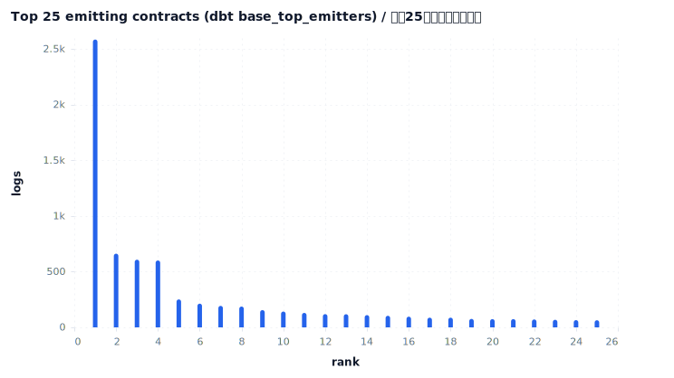
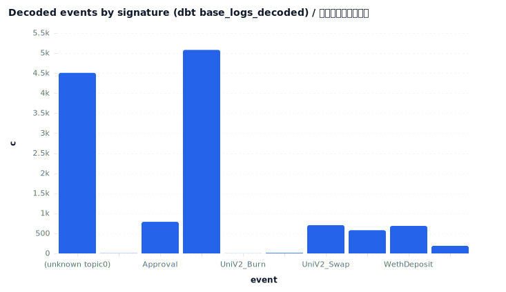
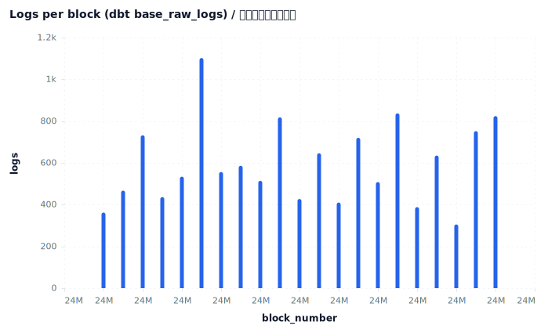
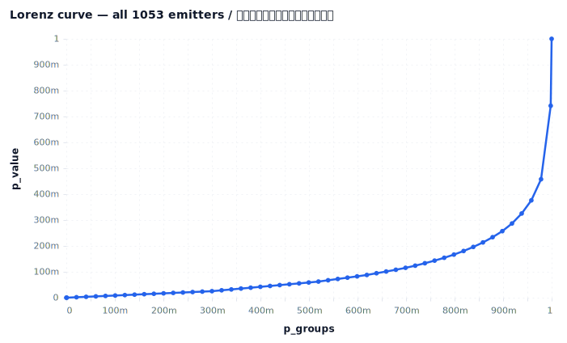

# Base mainnet — dbt-on-real-data snapshot

End-to-end proof of the v0.1.0 "dbt against real data" milestone: 12,559 real Base logs (24000000–24000020) pulled keyless, transformed by five dbt spellbook views, and reported here straight off those views.

## Executive summary

- **12,559 real Base logs** across **21 blocks** (24000000–24000020), from **1,053 distinct contracts** and **472 event signatures**.
- Every figure here is read from a **dbt spellbook view**, not from raw Parquet — the full curate-then-query pipeline ran against live data.
- **64.1%** of logs matched the topic0 decode dictionary; **5,079 ERC-20 transfers** across **337 tokens** were derived from raw logs alone.
- Emitter concentration is high: top-1 (WETH (L2 predeploy)) = **20.6%** of logs; Gini **0.795**, HHI **0.0527** over all 1053 contracts.
- Window: 2024-12-21 13:55:47 → 2024-12-21 13:56:27 (Base, ~2-second blocks). Pulled keyless over public RPC.

## 1. Provenance & methodology

**Pull (keyless)**: `chainq pull --chain base --from 24000000 --to 24000020 --source rpc`. Subsquid's v2 archive now requires an API key, so the snapshot pulled logs block-by-block over a public RPC (`eth_getLogs` + `eth_getBlockByNumber`), writing `data/base.logs.parquet` with the canonical 11-column schema.

**Transform**: `pnpm dbt:run --select live` built five spellbook views over that Parquet — `base_raw_logs`, `base_logs_decoded`, `base_erc20_transfers_derived`, `base_log_activity_hourly`, `base_top_emitters` — all PASS with their dbt schema tests.

**Report**: this file queries those views (not the raw file) and renders. Concentration (HHI / Gini / Lorenz) is computed over **all 1053 emitters**.

## 2. Top 25 emitting contracts

## 2a. Top 15 (labelled)

| rank | contract | logs | txs | sigs | share |
| --- | --- | --- | --- | --- | --- |
| 1 | WETH (L2 predeploy) | 2586 | 1287 | 4 | 20.59% |
| 2 | USDC (Circle native) | 662 | 364 | 3 | 5.27% |
| 3 | 0x827922686190790b37229fd06084350e74485b72 | 608 | 77 | 6 | 4.84% |
| 4 | 0xb84099396f8de44d2c996ed708126a2f059406f4 | 601 | 1 | 1 | 4.79% |
| 5 | ERC-4337 EntryPoint v0.6 | 251 | 30 | 4 | 2.00% |
| 6 | 0xca73ed1815e5915489570014e024b7ebe65de679 | 213 | 149 | 2 | 1.70% |
| 7 | 0x2faeb0760d4230ef2ac21496bb4f0b47d634fd4c | 193 | 15 | 2 | 1.54% |
| 8 | 0x974474c8bcb36302be93858466728271fb36544e | 187 | 10 | 1 | 1.49% |
| 9 | 0xcbb7c0000ab88b473b1f5afd9ef808440eed33bf | 155 | 85 | 2 | 1.23% |
| 10 | 0xc1a6d4ccb0e913c7f785fcc60811b34bc8cc801c | 142 | 71 | 2 | 1.13% |
| 11 | 0xdc88389898a30f67a2165791f1bdcf2d2ae94dcf | 130 | 65 | 2 | 1.04% |
| 12 | 0x940181a94a35a4569e4529a3cdfb74e38fd98631 | 119 | 58 | 2 | 0.95% |
| 13 | 0x6b2c0c7be2048daa9b5527982c29f48062b34d58 | 118 | 45 | 3 | 0.94% |
| 14 | 0x25646338f3d92d9c28a7ab9eb543efccfd67621b | 110 | 54 | 2 | 0.88% |
| 15 | 0xf312735acd921abbfac2e8b84c5d329c766d0c97 | 104 | 52 | 2 | 0.83% |

## 3. Decoded events

## 4. Per-block activity

## 5. Emitter concentration (all contracts)

| metric | value |
| --- | --- |
| top-1 share | 20.59% |
| top-5 share | 37.49% |
| top-10 share | 44.57% |
| HHI | 0.0527 |
| Gini | 0.795 |

## 6. Anomalies

**Peak block 24000005 stands out at 1,102 logs against the median block in window (556 logs) — 2.0× higher.** Concentrated DEX / settlement activity landed in one block.

**Single-tx emitter 0xb84099396f… stands out at 601 logs/tx against the window-wide logs/tx (6 logs/tx) — 100.2× higher.** It emitted 601 logs in 1 transaction(s) — a batch distribution that reshapes the emitter ranking until it is decoded.

## 7. Comparisons

- WETH (2,586 logs) is 3.9× higher than USDC (662 logs).

- peak block (1,102 logs) is 2.0× higher than median block (556 logs).

- decoded logs (8,052 logs) is 1.8× higher than undecoded logs (4,507 logs).

## 8. Action items

- **If you are a onchain due-diligence analyst:** decode 0xb84099396f…'s 601-log transaction before trusting any volume rollup — one tx is reshaping the emitter ranking (now)

- **If you are a tokenomics consultant:** treat Gini 0.795 as this window's baseline emitter concentration; flag client dashboards whose top-1 share exceeds 20.6% (this quarter)

- **If you are a wallet / account-abstraction integrator:** ERC-4337 EntryPoint shows 251 logs here — count UserOperations separately from EOA transactions when sizing active users (watch)

## Caveats

Window is small (21 blocks ≈ 42s) — a deliberate proof-of-pipeline, not a substantive market read. Widen by changing `--from/--to`.

topic0 decoding uses a ~14-signature hand-curated dictionary; the **35.9%** undecoded share would shrink against a full 4byte-style registry. Token `value` is carried as raw hex (no decimals applied), so this report counts transfer *events*, not USD volume.
